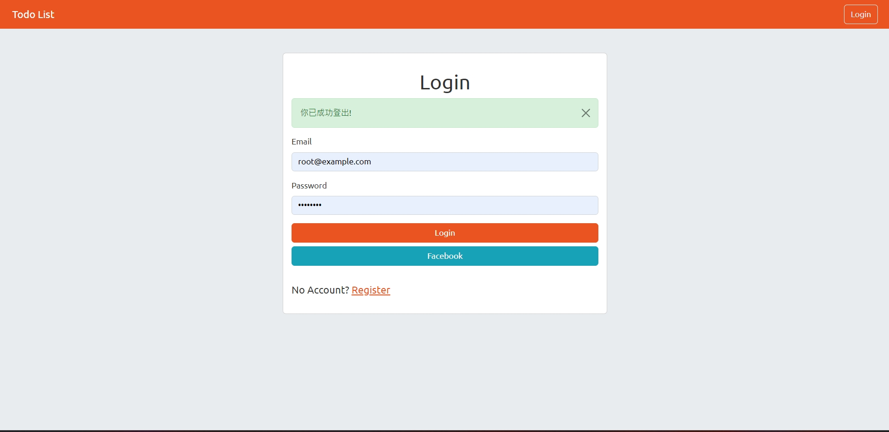
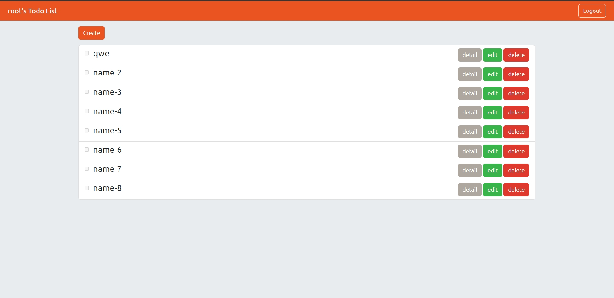
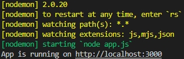

# Todo List


## 規格:
+ 程式編輯器: [Visual Studio Code](https://visualstudio.microsoft.com/zh-hant/ "Visual Studio Code") 
+ 使用框架: [express](https://www.npmjs.com/package/express)@4.17.1
+ 模板引擎: [express-handlebars](https://www.npmjs.com/package/express-handlebars)@4.0.4
+ [method-override](https://www.npmjs.com/package/method-override)@3.0.0
+ [mysql2](https://www.npmjs.com/package/mysql2)@2.1.0
+ [dotenv](https://www.npmjs.com/package/dotenv)@16.0.3
+ [bcryptjs](https://www.npmjs.com/package/bcryptjs)@2.4.3
+ [connect-flash](https://www.npmjs.com/package/connect-flash)@0.1.1
+ [express-session](https://www.npmjs.com/package/express-session)@1.17.3
+ [passport](https://www.npmjs.com/package/passport)@0.4.1
+ [passport-facebook](https://www.npmjs.com/package/passport-facebook)@3.0.0
+ [passport-local](https://www.npmjs.com/package/passport-local)@1.0.0
+ [sequelize](https://www.npmjs.com/package/sequelize)@5.21.13,
+ [sequelize-cli](https://www.npmjs.com/package/sequelize-cli)@5.5.1
---
## 功能:
+ 使用者可以註冊帳號，資料包刮名字、email、密碼、確認密碼
+ 使用者也可以透過Facebook註冊帳號
+ 使用者必須登入才可使用Todo List
+ 使用者可以在首頁看到所有Todo List的
  - 名字
  - 是否完成

+ 使用者可以新增Todo
+ 使用者可以刪除Todo
+ 使用者可以編輯Todo
---
## 安裝與執行:
1. clone此專案
```
git clone https://github.com/sd880428/todo-sequelize.git
```

2. 使用終端機到此專案目錄下
```
cd ~/.../todo-sequelize/
```
3. 安裝套件
```
npm i
```
4. 自行加入.env 檔

5. 在/config/config.json 設定MySql DB, 帳號, 密碼, host
6. 新增種子資料，在終端機輸入:
```
npx sequelize db:seed:all
```
6. 執行
```
npm run dev
```
如成功終端機會顯示:


6. 開啟瀏覽器進入 http://localhost:3000 即可

